<a name="readme-top"></a>
<div align="center">

# ft_printf

( a [42 School](https://github.com/42School) Project )

<p>
    
    
    
    
    
</p>

___

<h3>Table o'Contents</h3>
<p>
    ~
    <a href="#about-pushpin">About</a> ~
    <a href="#usage-checkered_flag">Usage</a> ~
    <a href="#implementation-scroll">Implementation</a> ~
    <a href="#structure-construction">Structure</a> ~
    <a href="#license-copyright">License</a> ~
</p>
<div/>

___

<div align="left">

# About :pushpin:

</div>

<div align=center>

> Because `ft_putnbr()` and `ft_putstr()` aren't enough!

This project is an exploration into how `printf()` works. The objective is to write a library that mimics the behaviour of `printf()`. A re-code challenge with the aim of revealing how `variadic functions` work in C. This project is an exercise on how to build a well-planned, well-structured extensible code base.

[ft_printf (Subject English)](/ft_printf.en.subject.pdf)

___

<div align="left">

# Usage :checkered_flag:

1. Clone the repo:
```shell
git clone git@github.com:PedroZappa/ft_printf.git 
```

2. Initialize local submodules configuration:
```shell
git submodule init
```

3. Update submodules:
```shell
git submodule update --recursive --remote
```

4. Build the project:
```shell
make bonus
```


</div>

____

<div align="left">

# Implementation :scroll:

In this project `printf()` is implemented with the following prototype:

```c
void	ft_printf(const char *format, ...);
```

## Constrains 

- To accomplish this, the implementation is limited to the use of [libft](https://github.com/PedroZappa/libft) (which makes its performance slower than the standard `printf()`) and a restricted set of standard functions.

    > For **memory allocation** and **deallocation**: `malloc()` and `free()`; 
    >
    > To **write** into the allocated memory: `write()`;
    >
    > To support **variadic functionality**: `va_start()`, `va_arg()`, `va_copy()`, `va_end()`;

- `ft_printf()` doesn't handle overflows and unexpected inputs the same way the real `printf()` would.

## Mandatory Requirements:exclamation:

- Do NOT implement the buffer management of the original `printf()`;
- The function has to handle the following conversions (format specifiers):

    | Format | Meaning |
    |--------|---------|
    | `%c` | Prints a single `char`;
    | `%s` | Prints a string of characters (`char *`);
    | `%p` | Prints a Pointer Address in hexadecimal (`void *`);
    | `%d` | Prints a decimal (base 10) number;
    | `%i` | Prints an integer in base 10;
    | `%u` | Prints an unsigned decimal (base 10) number;
    | `%x` | Prints a number in hexadecimal (base 16) lowercase format;
    | `%X` | Prints a number in hexadecimal (base 16) uppercase format;
    | `%%` | Prints a `%` character;

- Format specifiers obey the following prototype:

    ```c
    %[flags][width][.precision]specifier
    ```

- The function must behave like `printf()`;

- The library has to be built using the command `ar`;

## Bonus Requirements :money_mouth_face:

- Handle any combination of the following **flags** and **minimum field width** under all conversions;

    |    Flag   | Description |
    |-----------|---------|
    |      `-`  | Left justify within given **field width** |
    |      `0`  | Left-pads the number with zeroes (0) where padding is specified |
    | `.`       | Precision |

    | .precision | Description |
    |-----------|---------|
    | `.number` | For integer specifiers (`%d`, `%i`, `%u`, `%x`, `%X`) - specifies the minimum number of digits to be written. If the value to be written is shorter than this number the result is padded with leading zeroes. The value is not truncated even if the result is longer. A precision of 0 mean that no value is written for the value '0'; For `s`, this is the maximum numbers of characters to be printed. By default all characters are printed until the null terminator is found; |
    | `.` | The precision is not specified in the format string, but as an additional integer value argument preceding the argument that has to be formatted;

    |   Width    | Description |
    |------------|---------|
    | `(number)` | Minimum number of characters to be printed. If the value to be printed is shorter than this value, it is padded with blanks. The value is not truncated even if the result is larger |

- Plus the following flags (yes,one of them is a blank):

    | Flag | Description |
    |------|---------|
    | `#` | When used with `x` or `X` specifiers the value is prefixed with `0`, `0x` or `0X` respectively for values different than zero |
    | ` ` | If no sign is going to be written, print a space before the value |
    | `+` | Forces a plus or minus sign before printing the result |

## Structure :construction:

#### Mandatory Files & Folder Structure

`ft_printf()`s mandatory code base has the following file structure:


### Mandatory Processing Flow

The subprocesses of `ft_printf` mandatory implementation are called in the following order:


___

### Bonus Structure:exclamation:

#### Bonus Files & Folder Structure

`ft_printf()`s bonus code base has the following file structure:

```mermaid
---
title ft_printf w/ Bonus Structure
---
classDiagram
    class Makefile
    class libft["libft.h"]
    
    class ft_printf_h["ft_printf_bonus.h"]
    class ft_printf["ft_printf_bonus.c"]
    class ft_flag_utils["ft_flag_utils_bonus.c"]
    class ft_flags["ft_flags_bonus.c"]
    class ft_parse["ft_parse_bonus.c"]
    class ft_print_c["ft_print_c_bonus.c"]
    class ft_print_di["ft_print_di_bonus.c"]
    class ft_print_hex["ft_print_hex_bonus.c"]
    class ft_print_p["ft_print_p_bonus.c"]
    class ft_print_s["ft_print_s_bonus.c"]
    class ft_print_u["ft_print_u_bonus.c"]
   
    Makefile <-- ft_printf_h
    libft --> ft_printf_h
    ft_printf_h --> ft_printf
    ft_printf_h --> ft_flag_utils
    ft_printf_h --> ft_flags
    ft_printf_h --> ft_parse
    ft_printf_h --> ft_print_c
    ft_printf_h --> ft_print_di
    ft_printf_h --> ft_print_hex
    ft_printf_h --> ft_print_p
    ft_printf_h --> ft_print_s
    ft_printf_h --> ft_print_u
    
    ft_printf : ft_printf()
    ft_flag_utils : ft_isflag()
    ft_flag_utils : ft_isspecif()
    ft_flag_utils : ft_isflagtype()
    ft_flag_utils : ft_isflagtype()
    ft_flag_utils : ft_pad_width()
    ft_flags : ft_newformat()
    ft_flags : ft_resetformat()
    ft_flags : ft_flag_minus()
    ft_flags : ft_flag_digit()
    ft_flags : ft_flag_width()
    ft_flags : ft_flag_prec()
    ft_parse : ft_parse_bonus()
    ft_parse : ft_parse_flags()
    ft_parse : ft_parse_arg()
    ft_parse : ft_parse_width()
    ft_parse : ft_parse_prec()
    ft_print_c : ft_print_c()
    ft_print_di : ft_print_di()
    ft_print_di : ft_print_integer()
    ft_print_di : ft_print_precision()
    ft_print_di : ft_print_i()
    ft_print_hex : ft_print_x()
    ft_print_hex : ft_print_hexa()
    ft_print_hex : ft_print_puthex()
    ft_print_hex : ft_print_putx_prefix()
    ft_print_p : ft_print_p()
    ft_print_p : ft_print_ptr()
    ft_print_p : ft_print_address()
    ft_print_p : ft_ptrlen()
    ft_print_s : ft_print_s()
    ft_print_s : ft_putstr()
    ft_print_s : ft_print_s_precision()
    ft_print_s : ft_print_str()
    ft_print_u : ft_print_u()
    ft_print_u : ft_print_uint()
    ft_print_u : ft_print_uint()
    ft_print_u : ft_print_unsigned()
```



### Bonus Processing Flow

The subprocesses of `ft_printf` bonus implementation are called in the following order:


</div>

___

### License :copyright:

This work is published under the terms of <a href="https://github.com/PedroZappa/ft_printf/blob/master/LICENSE">42 Unlicense</a>.

<p align="right">(<a href="#readme-top">get to top</a>)</p>
